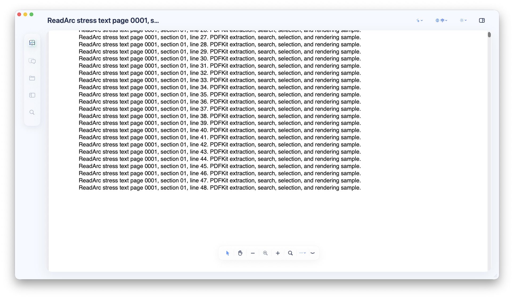

# ReadArc

<p align="center">
  
</p>

<p align="center">
  Native macOS PDF reading with a responsive canvas, reusable library folder, local search, and optional Codex / Claude Code assistance.
</p>

<p align="center">
  <a href="https://github.com/Zanetach/ReadArc/releases/latest"></a>
  
  
  
</p>

ReadArc keeps PDF rendering native with `PDFKit`, then adds a document-aware workspace for thumbnails, local search, outline review, quick actions, and optional local agent chat. The default path stays reader-first: opening a PDF takes you into the document, while Chat, Focus, Research, the Library, and the floating toolbar remain available when needed.

## Download

Download the latest Apple Silicon DMG from GitHub Releases:

[Download ReadArc for macOS](https://github.com/Zanetach/ReadArc/releases/latest)

Current public artifact:

| Item | Value |
| --- | --- |
| Release | `v0.2.12` |
| Artifact | `ReadArc-0.2.12-macOS-arm64.dmg` |
| System | macOS 14 or later |
| CPU | Apple Silicon |
| Signing | Ad-hoc signed, not notarized |

> This build machine does not have a Developer ID certificate or notary profile configured. The GitHub Release DMG is ad-hoc signed and not notarized, so macOS may require right-clicking `ReadArc.app` and choosing **Open**, or allowing it from **System Settings > Privacy & Security**.

## What ReadArc Does

| Area | Details |
| --- | --- |
| Native PDF reading | Opens local PDFs with `PDFView`, page navigation, zoom controls, fit-to-view, double-click zoom, text selection, and drag-to-pan mode. |
| ReadArc Library | Lets the user choose a library folder once, imports PDFs there, and reuses that folder permission for future reading, Chat, search, thumbnails, and indexing. |
| Page thumbnails | Shows a toggleable thumbnail rail for PDF navigation, with cached thumbnail rendering and a compact left command rail. |
| Search | Searches the current PDF, bounds result memory, and jumps to exact match positions with PDFKit highlighting. The search popover now lives in the floating toolbar. |
| Agent chat | Uses local Codex or Claude Code when available, streams responses, shows timestamps and elapsed time, supports copy actions, and formats structured answers as readable cards. |
| Mind maps | Detects common outline / mind-map style responses and renders them as nested visual nodes instead of raw text blocks. |
| Focus and Research panels | Keeps summaries, search matches, outline, document metadata, and quick research actions in the right-side workspace. |
| Performance guardrails | Bounds search results, cached page text, thumbnails, chat history, and unusually long streamed agent output. Stale recent PDFs are removed with a friendly message. |
| Appearance | Light, dark, and follow-system themes with Chinese and English UI modes. |
| Window behavior | Keeps one main window active for quick-open flows, supports standard macOS resizing, and disables stale state restoration. |
| Release tooling | Builds `.app`, packages a macOS DMG, emits SHA-256 checksums, and publishes GitHub Releases. |

## Privacy and File Access

ReadArc does not ask for Full Disk Access.

The intended flow is:

1. Choose a `ReadArc Library` folder once.
2. Open or drag in PDFs.
3. ReadArc imports those PDFs into the library folder.
4. Chat, search, thumbnails, and indexing reuse the library copy.

This avoids repeated per-PDF permission prompts while staying aligned with macOS user-selected file and folder access. If no library folder is selected, ReadArc can still open a PDF once using the standard file selection flow.

## Agent Support

Agent features are optional. Reading, thumbnails, search, theme, language, and local PDF navigation work without agent CLIs installed.

| Agent | Runtime expected on `PATH` | Integration |
| --- | --- | --- |
| Codex | `codex` | Streams JSON output from `codex exec` with bounded PDF context. |
| Claude Code | `claude` | Streams `stream-json` events and coalesces assistant deltas. |

Agent prompts include bounded PDF text context only. ReadArc does not pass local PDF folder paths into the prompt.

## Install From DMG

1. Download the DMG from [Releases](https://github.com/Zanetach/ReadArc/releases/latest).
2. Open the DMG.
3. Drag `ReadArc.app` into `Applications`.
4. Open ReadArc from Finder or Launchpad.
5. Choose a ReadArc Library folder when prompted.

If macOS blocks the app because it is not notarized, right-click `ReadArc.app`, choose **Open**, then confirm.

## Run Locally

Requirements:

- macOS 14+
- Xcode command line tools
- SwiftPM

```bash
./script/build_and_run.sh
```

The Codex app run configuration points at this script through `.codex/environments/environment.toml`.

## Verify

```bash
swift build --build-system native
swift run --build-system native ReadArcCoreSmokeTests
./script/build_and_run.sh --verify
```

Release build:

```bash
swift build -c release --build-system native
```

## Package and Release

Create a local Apple Silicon DMG:

```bash
./script/release_github.sh --version 0.2.12 --ad-hoc --skip-notary --format dmg
```

Publish a GitHub Release with the ad-hoc Apple Silicon DMG:

```bash
./script/release_github.sh --version 0.2.12 --publish --ready --ad-hoc --skip-notary --format dmg
```

Create a Developer ID signed and notarized release when Apple credentials are configured:

```bash
READARC_CODESIGN_IDENTITY="Developer ID Application: Your Name (TEAMID)" \
READARC_NOTARY_PROFILE="readarc-notary" \
./script/release_github.sh --version 0.2.12 --publish --ready --format dmg
```

Store notarization credentials once:

```bash
xcrun notarytool store-credentials readarc-notary \
  --apple-id "APPLE_ID_EMAIL" \
  --team-id "TEAM_ID" \
  --password "APP_SPECIFIC_PASSWORD"
```

## Stress Test PDFs

Generate and sample large synthetic PDFs:

```bash
./script/stress_pdf_performance.sh --sample-seconds 20 --cases text500,text1000,scan200,mixed300
```

Test a real PDF:

```bash
./script/stress_pdf_performance.sh --sample-seconds 60 --pdf /path/to/large.pdf
```

Reports are written to `dist/stress-reports/`.

## Project Layout

```text
Sources/ReadArc/                 macOS SwiftUI app
Sources/ReadArcCore/             parsers, prompt builders, stores, formatters
Sources/ReadArcCoreSmokeTests/   executable smoke tests
docs/                            README screenshots and documentation images
design/assets/                   README and product assets
design/logo-options/             logo exploration assets
design/screenshots/              UI verification screenshots
script/build_and_run.sh          local app bundle builder and runner
script/release_github.sh         DMG and GitHub Release publisher
script/stress_pdf_performance.sh large PDF performance sampler
```

## 中文简介

ReadArc 是一个原生 macOS PDF 阅读器。打开 PDF 后默认进入阅读体验，可以按需打开缩略图、资料库、对话、专注和研究面板。新版本支持选择一个 `ReadArc Library` 资料库文件夹，之后 PDF 会导入到该文件夹，Chat、搜索、缩略图和索引可以复用资料库权限，减少每个 PDF 都要单独授权的打断。

Agent 功能是可选的：安装 `codex` 或 `claude` CLI 后，可以让 ReadArc 基于当前 PDF 的受限上下文进行总结、解释、检索和分析。当前 GitHub Release 提供 Apple Silicon DMG。由于本机没有 Apple Developer ID 证书，安装包为 ad-hoc 签名且未公证。

## Notes

- ReadArc is not configured for Mac App Store distribution.
- The current public DMG is ad-hoc signed and not notarized.
- Codex and Claude Code support depends on the corresponding local CLI tools being installed.
- No license file is currently included in this repository.
