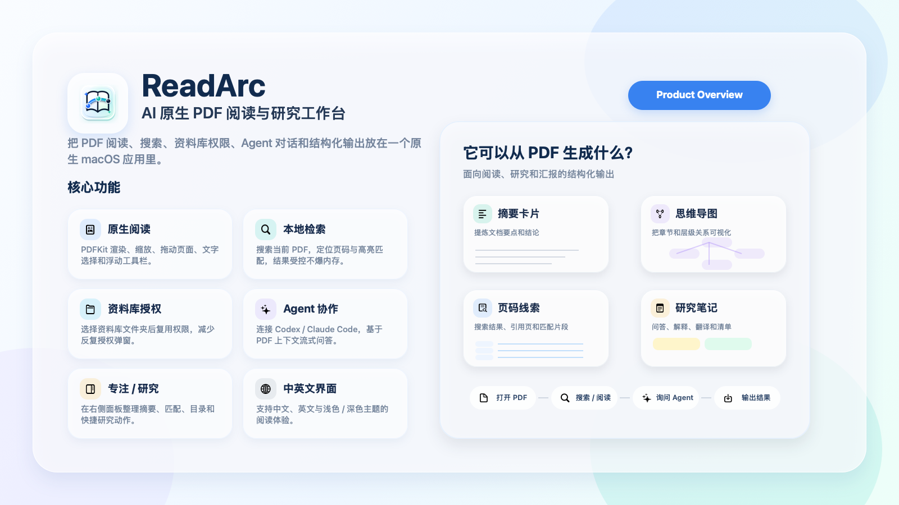
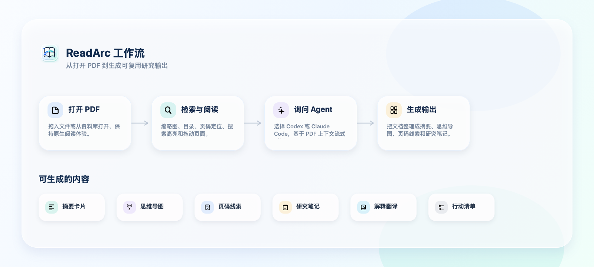

# ReadArc

<p align="center">
  
</p>

<p align="center">
  AI 原生 PDF 阅读与研究工作台。把阅读、检索、资料库权限、Agent 对话和结构化输出放进一个原生 macOS App。
</p>

<p align="center">
  <a href="https://github.com/Zanetach/ReadArc/releases/latest"></a>
  
  
  
  
</p>

ReadArc 是一个基于 `SwiftUI` + `PDFKit` 的原生 macOS PDF 阅读器。它首先是一个干净、快速的 PDF 阅读工具，同时在右侧提供 Chat、Focus、Research 工作区，用于基于当前 PDF 进行总结、解释、搜索、目录梳理和思维导图生成。

## 下载

[下载最新 ReadArc for macOS](https://github.com/Zanetach/ReadArc/releases/latest)

| 项目 | 当前状态 |
| --- | --- |
| Release | `v0.2.14` |
| Artifact | `ReadArc-0.2.14-macOS-arm64.dmg` |
| 系统 | macOS 14 或更高 |
| 芯片 | Apple Silicon |
| 签名 | Ad-hoc signed, not notarized |
| License | Proprietary use-only |

> 当前构建机器没有配置 Apple Developer ID 证书和公证资料，因此 GitHub Release 中的 DMG 是 ad-hoc 签名且未公证。首次打开时，macOS 可能需要右键点击 `ReadArc.app` 选择 **Open**，或在 **System Settings > Privacy & Security** 中允许打开。

## 图文速览

<p align="center">
  
</p>

ReadArc 的目标不是把 PDF 变成一个普通聊天窗口，而是保留 PDF 可见、页码可追溯、阅读不中断的前提下，让 Agent 只在需要时参与。

| 阶段 | ReadArc 做什么 |
| --- | --- |
| 打开 PDF | 通过系统文件选择、拖拽或资料库打开 PDF，保持原生 `PDFKit` 阅读体验。 |
| 阅读与检索 | 使用缩略图、目录、页码跳转、搜索高亮、双击缩放、文字选择和拖动页面。 |
| 询问 Agent | 选择 `Codex` 或 `Claude Code`，基于受限 PDF 上下文进行流式对话。 |
| 生成输出 | 将 PDF 内容整理为摘要、思维导图、页码线索、研究笔记、解释翻译或行动清单。 |

## 核心功能

| 功能 | 说明 |
| --- | --- |
| 原生 PDF 阅读 | 使用 `PDFView` 渲染 PDF，支持页码导航、缩放、适配页面、双击放大、文字选择和拖动页面。 |
| 浮动工具栏 | 把选择、拖动、缩放、搜索和更多操作放在 PDF 画布底部，减少顶部工具栏干扰。 |
| 缩略图面板 | 支持开关缩略图面板，快速定位页面，并对缩略图搜索做缓存和防抖。 |
| 本地搜索 | 搜索当前 PDF，限制结果数量和内存占用，并跳转到 PDFKit 高亮位置。 |
| ReadArc Library | 选择资料库文件夹后导入 PDF，后续 Chat、搜索、缩略图和索引复用资料库权限，减少反复授权。 |
| Agent 对话 | 支持本地 `codex` / `claude` CLI，流式展示回答，并对长输出做边界控制。 |
| 专注 / 研究面板 | 在右侧面板展示摘要、搜索匹配、目录、文档指标和快捷研究动作。 |
| 思维导图渲染 | 识别常见树形 / Mermaid mindmap 输出，并渲染成可读的层级视觉节点。 |
| 中英文与主题 | 支持中文、英文、浅色、深色和跟随系统主题。 |
| 窗口行为 | 保持单主窗口，支持 macOS 自由缩放，避免快捷打开 PDF 时重复窗口。 |

## 能生成什么

ReadArc 的 Agent 输出会在 App 内以更适合阅读的样式展示。当前重点是结构化文本和视觉化层级，而不是把结果导出成图片文件。

| 输出 | 适合场景 |
| --- | --- |
| 摘要卡片 | 快速理解论文、合同、报告、产品文档的核心结论。 |
| 思维导图 | 将章节、痛点、方案、流程或论证结构转成层级图。 |
| 页码线索 | 将问题答案、搜索结果和引用页码关联起来，便于回到原文核对。 |
| 研究笔记 | 对当前 PDF 做解释、改写、翻译、问答和补充分析。 |
| 行动清单 | 从方案、会议纪要或操作文档里提取下一步任务。 |
| 对比表格 | 将多个概念、方案、条款或章节整理成对照结构。 |

## 文件权限与隐私

ReadArc 不要求 Full Disk Access。

推荐流程：

1. 首次使用时选择一个 `ReadArc Library` 资料库文件夹。
2. 打开或拖入 PDF。
3. ReadArc 将 PDF 导入资料库。
4. 后续阅读、Chat、搜索、缩略图和索引都读取资料库副本。

这个设计比申请全盘访问更符合 macOS 权限模型，也能避免每次 Agent 对话都重新触发 Documents / Downloads 文件授权。

## Agent 支持

Agent 功能是可选的。即使没有安装 Agent CLI，阅读、缩略图、搜索、主题、语言和本地 PDF 导航也能正常使用。

| Agent | 需要的本地命令 | 集成方式 |
| --- | --- | --- |
| Codex | `codex` | 通过 `codex exec` 获取流式 JSON 输出，并传入受限 PDF 上下文。 |
| Claude Code | `claude` | 使用 `stream-json` 事件流，合并 assistant delta 后显示。 |

ReadArc 不会把本地 PDF 原始路径写进 Prompt。Agent 只接收经过裁剪的 PDF 文本上下文、页码和目录信息。

## 安装

1. 从 [GitHub Releases](https://github.com/Zanetach/ReadArc/releases/latest) 下载 DMG。
2. 打开 DMG。
3. 将 `ReadArc.app` 拖入 `Applications`。
4. 从 Finder 或 Launchpad 打开 ReadArc。
5. 按提示选择 ReadArc Library 资料库文件夹。

如果 macOS 阻止打开未公证 App，请右键点击 `ReadArc.app`，选择 **Open**，然后确认。

## 本地运行

要求：

- macOS 14+
- Xcode Command Line Tools
- SwiftPM

```bash
./script/build_and_run.sh
```

Codex App 的运行配置位于 `.codex/environments/environment.toml`，会调用上面的脚本启动本地 App。

## 验证

```bash
swift build --build-system native
swift run --build-system native ReadArcCoreSmokeTests
./script/build_and_run.sh --verify
```

Release build:

```bash
swift build -c release --build-system native
```

## 打包与发布

生成本地 Apple Silicon DMG：

```bash
./script/release_github.sh --version 0.2.14 --ad-hoc --skip-notary --format dmg
```

发布 ad-hoc Apple Silicon DMG 到 GitHub Release：

```bash
./script/release_github.sh --version 0.2.14 --publish --ready --ad-hoc --skip-notary --format dmg
```

如果已经配置 Developer ID 和 notary profile，可以生成正式签名并公证的发布包：

```bash
READARC_CODESIGN_IDENTITY="Developer ID Application: Your Name (TEAMID)" \
READARC_NOTARY_PROFILE="readarc-notary" \
./script/release_github.sh --version 0.2.14 --publish --ready --format dmg
```

## 压力测试 PDF

生成并采样大 PDF：

```bash
./script/stress_pdf_performance.sh --sample-seconds 20 --cases text500,text1000,scan200,mixed300
```

测试真实 PDF：

```bash
./script/stress_pdf_performance.sh --sample-seconds 60 --pdf /path/to/large.pdf
```

报告会写入 `dist/stress-reports/`。

## 项目结构

```text
Sources/ReadArc/                 macOS SwiftUI app
Sources/ReadArcCore/             parsers, prompt builders, stores, formatters
Sources/ReadArcCoreSmokeTests/   executable smoke tests
docs/                            README screenshots and documentation images
design/assets/                   README and product assets
design/logo-options/             logo exploration assets
design/screenshots/              UI verification screenshots
script/build_and_run.sh          local app bundle builder and runner
script/release_github.sh         DMG and GitHub Release publisher
script/stress_pdf_performance.sh large PDF performance sampler
```

## License

ReadArc is source-available but not open source. Users are granted only the
right to download, install, and use the official ReadArc application. Modification,
redistribution, sublicensing, derivative works, and publishing modified or
unmodified builds are not permitted without prior written permission.

See [LICENSE](LICENSE) for the full proprietary use-only license.

## English Summary

ReadArc is a native macOS PDF reader built with SwiftUI and PDFKit. It keeps PDF reading visible and local, then adds optional Codex / Claude Code assistance for summaries, search-backed answers, outlines, mind maps, notes, and research workflows. The current public release ships as an Apple Silicon DMG.

## Notes

- ReadArc is not configured for Mac App Store distribution.
- The current public DMG is ad-hoc signed and not notarized.
- Codex and Claude Code support depends on the corresponding local CLI tools being installed.
- ReadArc is licensed under a proprietary use-only license.
