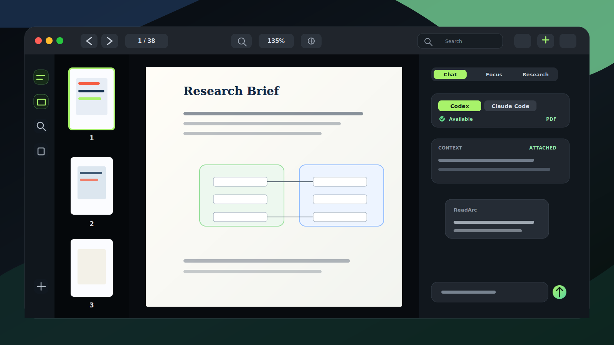

# ReadArc

<p align="center">
  
</p>

<p align="center">
  A native macOS PDF reader with thumbnails, search, and an optional Codex / Claude Code agent workspace.
</p>

<p align="center">
  <a href="https://github.com/Zanetach/ReadArc/releases/latest"></a>
  
  
  
</p>

ReadArc keeps the core reading experience native and local with `PDFKit`, then adds a document-aware workspace for search evidence, outlines, notes, and optional local agents. Chat is not opened by default: opening a PDF takes you straight into the reader with page thumbnails.

## Download

Download the latest Apple Silicon DMG from GitHub Releases:

[Download ReadArc for macOS](https://github.com/Zanetach/ReadArc/releases/latest)

Current public artifact:

| Item | Value |
| --- | --- |
| Release | `v0.2.6` |
| Artifact | `ReadArc-0.2.6-macOS-arm64.dmg` |
| System | macOS 14 or later |
| CPU | Apple Silicon |
| Signing | Ad-hoc signed, not notarized |

> This build machine does not have a Developer ID certificate or notary profile configured. The GitHub Release DMG is ad-hoc signed and not notarized, so macOS may require right-clicking `ReadArc.app` and choosing **Open**, or allowing it from **System Settings > Privacy & Security**.

## What ReadArc Does

| Area | Details |
| --- | --- |
| Native PDF reading | Opens local PDFs with `PDFView`, page navigation, zoom controls, fit-to-view, and double-click zoom. |
| Page thumbnails | Automatically opens the thumbnail rail after a PDF loads; the library remains available from the left rail. |
| Search and evidence | Searches the current PDF, limits result memory, and jumps to exact match positions with PDFKit highlighting. |
| Document workspace | Right panel supports Chat, Focus, and Research modes; it is resizable and hidden by default. |
| Agent chat | Uses local Codex or Claude Code when available, streams responses, shows timestamps and elapsed time, and supports copy actions. |
| Memory guardrails | Bounds search results, cached page text, thumbnails, chat history, and unusually long streamed agent output. |
| Preferences | Light, dark, and follow-system appearance; Chinese and English UI modes from the left rail settings menu. |
| Release tooling | Builds `.app`, packages a standard macOS DMG, emits checksums, and publishes GitHub Releases. |

## 中文简介

ReadArc 是一个原生 macOS PDF 阅读器。打开 PDF 后默认显示页面缩略图，不会自动打开 Chat。你可以在右侧按需打开 `对话 / 专注 / 研究` 面板，使用 Codex 或 Claude Code 对当前 PDF 进行总结、解释、检索和分析。

当前 GitHub Release 提供 Apple Silicon DMG。由于本机没有 Apple Developer ID 证书，安装包为 ad-hoc 签名且未公证。

## Agent Support

Agent features are optional. Reading, thumbnails, search, theme, language, and local PDF navigation work without agent CLIs installed.

| Agent | Runtime expected on `PATH` | Integration |
| --- | --- | --- |
| Codex | `codex` | Streams JSON output from `codex exec` with bounded PDF context. |
| Claude Code | `claude` | Streams `stream-json` events and coalesces assistant deltas. |

## Install From DMG

1. Download the DMG from [Releases](https://github.com/Zanetach/ReadArc/releases/latest).
2. Open the DMG.
3. Drag `ReadArc.app` into `Applications`.
4. Open ReadArc from Finder or Launchpad.

If macOS blocks the app because it is not notarized, right-click `ReadArc.app`, choose **Open**, then confirm.

## Run Locally

Requirements:

- macOS 14+
- Xcode command line tools
- SwiftPM

```bash
./script/build_and_run.sh
```

The Codex app run configuration points at this script through `.codex/environments/environment.toml`.

## Verify

```bash
swift build
swift run ReadArcCoreSmokeTests
./script/build_and_run.sh --verify
```

Release build:

```bash
swift build -c release
```

## Package and Release

Create a local Apple Silicon DMG:

```bash
./script/release_github.sh --version 0.2.6 --ad-hoc --skip-notary --format dmg
```

Publish a GitHub Release with the ad-hoc Apple Silicon DMG:

```bash
./script/release_github.sh --version 0.2.6 --publish --ready --ad-hoc --skip-notary --format dmg
```

Create a Developer ID signed and notarized release when Apple credentials are configured:

```bash
READARC_CODESIGN_IDENTITY="Developer ID Application: Your Name (TEAMID)" \
READARC_NOTARY_PROFILE="readarc-notary" \
./script/release_github.sh --version 0.2.6 --publish --ready --format dmg
```

Store notarization credentials once:

```bash
xcrun notarytool store-credentials readarc-notary \
  --apple-id "APPLE_ID_EMAIL" \
  --team-id "TEAM_ID" \
  --password "APP_SPECIFIC_PASSWORD"
```

## Stress Test PDFs

Generate and sample large synthetic PDFs:

```bash
./script/stress_pdf_performance.sh --sample-seconds 20 --cases text500,text1000,scan200,mixed300
```

Test a real PDF:

```bash
./script/stress_pdf_performance.sh --sample-seconds 60 --pdf /path/to/large.pdf
```

Reports are written to `dist/stress-reports/`.

## Project Layout

```text
Sources/ReadArc/                 macOS SwiftUI app
Sources/ReadArcCore/             parsers, prompt builders, stores, formatters
Sources/ReadArcCoreSmokeTests/   executable smoke tests
design/assets/                   README and product assets
design/logo-options/             logo exploration assets
script/build_and_run.sh          local app bundle builder and runner
script/release_github.sh         DMG and GitHub Release publisher
script/stress_pdf_performance.sh large PDF performance sampler
```

## Notes

- ReadArc is not configured for Mac App Store distribution.
- The current public DMG is ad-hoc signed and not notarized.
- Codex and Claude Code support depends on the corresponding local CLI tools being installed.
- No license file is currently included in this repository.
